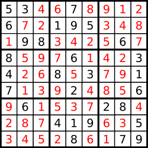

## Problem Description

| Problem Statement                                                                                           | Solution Link                                                                                                                               | LeetCode Profile                                   |
| :----------------------------------------------------------------------------------------------------------- | :------------------------------------------------------------------------------------------------------------------------------------------ | :------------------------------------------------- |
| [Sudoku-Solver](https://leetcode.com/problems/sudoku-solver/description/)                                         | [Sudoku-Solver](https://leetcode.com/problems/sudoku-solver/description/) | [DaminiChachane](https://leetcode.com/u/divcxl15/) |

### Problem Description

Write a program to solve a Sudoku puzzle by filling the empty cells.

A sudoku solution must satisfy all of the following rules:

Each of the digits 1-9 must occur exactly once in each row.
Each of the digits 1-9 must occur exactly once in each column.
Each of the digits 1-9 must occur exactly once in each of the 9 3x3 sub-boxes of the grid.
The '.' character indicates empty cells.


### Examples

#### Example 1

- **Input:** ` board = [["5","3",".",".","7",".",".",".","."],["6",".",".","1","9","5",".",".","."],[".","9","8",".",".",".",".","6","."],["8",".",".",".","6",".",".",".","3"],["4",".",".","8",".","3",".",".","1"],["7",".",".",".","2",".",".",".","6"],[".","6",".",".",".",".","2","8","."],[".",".",".","4","1","9",".",".","5"],[".",".",".",".","8",".",".","7","9"]] `
- **Output:** `[["5","3","4","6","7","8","9","1","2"],["6","7","2","1","9","5","3","4","8"],["1","9","8","3","4","2","5","6","7"],["8","5","9","7","6","1","4","2","3"],["4","2","6","8","5","3","7","9","1"],["7","1","3","9","2","4","8","5","6"],["9","6","1","5","3","7","2","8","4"],["2","8","7","4","1","9","6","3","5"],["3","4","5","2","8","6","1","7","9"]]`
- **Explanation:** `The input board is shown above and the only valid solution is shown below:

`

### Constraints

`- board.length == 9
- board[i].length == 9
- board[i][j] is a digit or '.'.
- It is guaranteed that the input board has only one solution.`

### Approach

Solving a Sudoku puzzle can be approached using various methods, ranging from simple logical deductions to more complex algorithms.  

### Solution Code

#### Python

```
class Solution:
    def solveSudoku(self, board: List[List[str]]) -> None:
        n = 9
        
        
        def isValid(row, col, ch):
            row, col = int(row), int(col)
            
            for i in range(9):
                
                if board[i][col] == ch:
                    return False
                if board[row][i] == ch:
                    return False
                
                if board[3*(row//3) + i//3][3*(col//3) + i%3] == ch:
                    return False
            
            return True
            
        def solve(row, col):
            if row == n:
                return True
            if col == n:
                return solve(row+1, 0)
            
            if board[row][col] == ".":
                for i in range(1, 10):
                    if isValid(row, col, str(i)):
                        board[row][col] = str(i)
                        
                        if solve(row, col + 1):
                            return True
                        else:
                            board[row][col] = "."
                return False
            else:
                return solve(row, col + 1)
            
            
        
        solve(0, 0)
		
		#do upvote if it helps.
```

#### Java
```

class Solution {
   private static final char EMPTY_ENTRY = '.';

/*
  Driver function to kick off the recursion
*/
public static boolean solveSudoku(char[][] board){
  return solveSudokuCell(0, 0, board);
}

/*
  This function chooses a placement for the cell at (row, col)
  and continues solving based on the rules we define.
  
  Our strategy:
  We will start at row 0.
  We will solve every column in that row.
  When we reach the last column we move to the next row.
  If this is past the last row (row == board.length) we are done.
  The whole board has been solved.
*/
private static boolean solveSudokuCell(int row, int col, char[][] board) {

  /*
    Have we finished placements in all columns for
    the row we are working on?
  */
  if (col == board[row].length){

    /*
      Yes. Reset to col 0 and advance the row by 1.
      We will work on the next row.
    */
    col = 0;
    row++;

    /*
      Have we completed placements in all rows? If so then we are done.
      If not, drop through to the logic below and keep solving things.
    */
    if (row == board.length){
      return true; // Entire board has been filled without conflict.
    }

  }

  // Skip non-empty entries. They already have a value in them.
  if (board[row][col] != EMPTY_ENTRY) {
    return solveSudokuCell(row, col + 1, board);
  }

  /*
    Try all values 1 through 9 in the cell at (row, col).
    Recurse on the placement if it doesn't break the constraints of Sudoku.
  */
  for (int value = 1; value <= board.length; value++) {

    char charToPlace = (char) (value + '0'); // convert int value to char

    /*
      Apply constraints. We will only add the value to the cell if
      adding it won't cause us to break sudoku rules.
    */
    if (canPlaceValue(board, row, col, charToPlace)) {
      board[row][col] = charToPlace;
      if (solveSudokuCell(row, col + 1, board)) { // recurse with our VALID placement
        return true;
      }
    }

  }

  /*
    Undo assignment to this cell. No values worked in it meaning that
    previous states put us in a position we cannot solve from. Hence,
    we backtrack by returning "false" to our caller.
  */
  board[row][col] = EMPTY_ENTRY;
  return false; // No valid placement was found, this path is faulty, return false
}

/*
  Will the placement at (row, col) break the Sudoku properties?
*/
private static boolean canPlaceValue(char[][] board, int row, int col, char charToPlace) {

  // Check column constraint. For each row, we do a check on column "col".
  for (char[] element : board) {
    if (charToPlace == element[col]){
      return false;
    }
  }

  // Check row constraint. For each column in row "row", we do a check.
  for (int i = 0; i < board.length; i++) {
    if (charToPlace == board[row][i]) {
      return false;
    }
  }

  /*
    Check region constraints.
    
    In a 9 x 9 board, we will have 9 sub-boxes (3 rows of 3 sub-boxes).
    
    The "I" tells us that we are in the Ith sub-box row. (there are 3 sub-box rows)
    The "J" tells us that we are in the Jth sub-box column. (there are 3 sub-box columns)
    
    I tried to think of better variable names for like 20 minutes but couldn't so just left
    I and J.
    
    Integer properties will truncate the decimal place so we just know the sub-box number we are in.
    Each coordinate we touch will be found by an offset from topLeftOfSubBoxRow and topLeftOfSubBoxCol.
  */
  int regionSize = (int) Math.sqrt(board.length); // gives us the size of a sub-box

  int I = row / regionSize;
  int J = col / regionSize;

  /*
    This multiplication takes us to the EXACT top left of the sub-box. We keep the (row, col)
    of these values because it is important. It lets us traverse the sub-box with our double for loop.
  */
  int topLeftOfSubBoxRow = regionSize * I; // the row of the top left of the block
  int topLeftOfSubBoxCol = regionSize * J; // the column of the tol left of the block

  for (int i = 0; i < regionSize; i++) {
    for (int j = 0; j < regionSize; j++) {

      /*
        i and j just define our offsets from topLeftOfBlockRow
        and topLeftOfBlockCol respectively
      */
      if (charToPlace == board[topLeftOfSubBoxRow + i][topLeftOfSubBoxCol + j]) {
        return false;
      }

    }
  }

  return true; // placement is valid
}
}
```

#### C++
```
class Solution {
public:
    bool isSafe(int& row,int& col,vector<vector<char>>& v, char& c)
    {
        for(int i=0;i<9;i++)
        {
            if(v[row][i]==c) return false;
            if(v[i][col]==c) return false;
            if(v[3*(row/3)+i/3][3*(col/3)+i%3]==c) return false;
        }
        return true;
    }
    void solve(int i,int j,vector<vector<char>>& v,int& flag)
    {
        if(i==9){
            flag=0;
            return;
            
        }
        if(v[i][j]!='.')
        {
            if(j<8) solve(i,j+1,v,flag);
            else solve(i+1,0,v,flag);
        }
        else{
        for(char c='9';c>='1';c--)
        {
            if(isSafe(i,j,v,c))
            { 
                v[i][j]=c;
                if(j==8) solve(i+1,0,v,flag);
                else solve(i,j+1,v,flag);
                if(flag==0) return;
                v[i][j]='.';
            }
        } 
        }
    }
    void solveSudoku(vector<vector<char>>& v) {
        int flag=-1;
        solve(0,0,v,flag);
    }
};
```

### Conclusion
Each method has its strengths and weaknesses, and often a combination of techniques is used in advanced Sudoku solvers to achieve better performance and accuracy. Backtracking remains a foundational approach due to its simplicity and guaranteed correctness, making it an excellent starting point for understanding more complex solving techniques.


